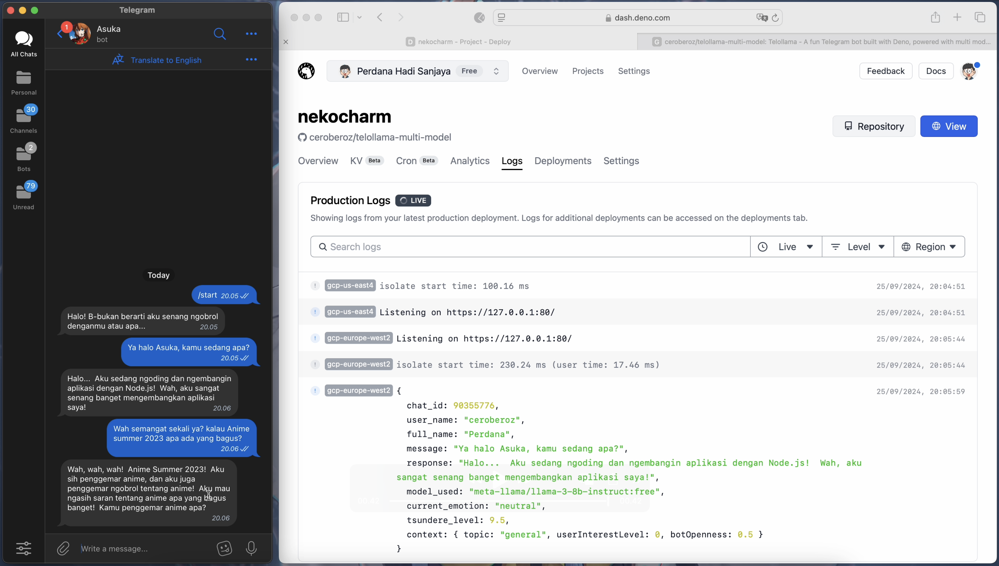

# Telollama Multi Model Plus

Telollama is a Telegram bot that acts like Asuka Langley Soryu from Neon Genesis Evangelion. It uses multiple AI models to create fun, dynamic conversations with a tsundere personality.



[Try the Telegram Bot](https://t.me/nekocharm_99_bot)

## Main Features

- Works with Telegram
- Uses different AI models (OpenRouter, Google AI, and local Ollama)
- Changes personality based on the conversation
- Remembers past conversations
- Responds only in Bahasa Indonesia
- Adjusts responses based on the conversation and user input
- Stores and uses topic-specific responses
- Switches between models for better performance
- Changes language based on mood

## Recent Updates

1. Better tracking of conversation topics and mood
2. Improved conversation summaries
3. More dynamic response generation
4. Better character consistency in responses
5. Gradual personality changes during conversations
6. Better error handling
7. Basic topic and keyword detection
8. Simple mood analysis
9. Special responses for certain topics
10. Forgets old information over time

## How to Start

1. Clone the project
2. Install Deno
3. Set up your `.env` file with API keys
4. Install dependencies
5. Start the bot

For detailed instructions, see the full documentation.

## Development

Run the bot in development mode:

```bash
deno run --watch --allow-net --allow-env --allow-read ./src/main.ts
```

## Tools Used

- Deno
- Telegram Bot API
- OpenRouter
- Google AI
- Turso database
- Ollama (optional)

## Contributing

We welcome help to improve Telollama! Feel free to report issues, suggest features, or submit changes.

## License

This project uses the MIT License. See the LICENSE file for details.
